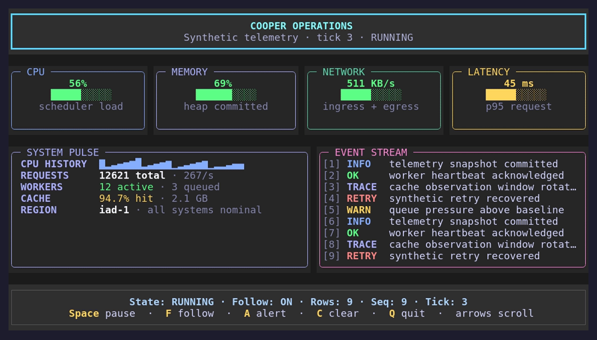

# Cooper

**An Ard-native imperative retained-mode TUI framework** powered by
[Vaxis](https://github.com/rockorager/vaxis).

Cooper keeps application state, control identity, hierarchy, layout geometry,
focus, listeners, and selection in persistent Ard controls. Layout updates
attached Nodes in place, and drawing writes directly into one logical cell
buffer for Vaxis to diff.



## Status

Cooper is under active development and requires Ard v0.38.0 or newer. The
accepted application API, built-in controls, headless TestApp, and runnable
examples are implemented.

The canonical design is defined by the accepted
[application API ADR](./docs/adrs/0002-define-application-api.md),
[interaction ADR](./docs/adrs/0003-define-interaction-focus-and-selection.md),
[input editor ADR](./docs/adrs/0004-define-input-editor-and-keybindings.md),
[rich Text ADR](./docs/adrs/0005-define-rich-text-wrapping-and-multi-click-selection.md),
[terminal clipboard ADR](./docs/adrs/0006-define-terminal-clipboard-access.md),
[scrollbar ADR](./docs/adrs/0007-define-scrollbars-and-two-axis-scrolling.md),
[Select ADR](./docs/adrs/0008-define-select-controls-and-appearance-overrides.md),
[notification ADR](./docs/adrs/0009-define-terminal-mediated-notifications.md), and
[terminal progress ADR](./docs/adrs/0010-define-terminal-progress-reporting.md).
Cooper has no compatibility constraint while it is implemented.

## Application shape

```ard
use cooper/app
use cooper/style
use cooper/ui

fn main() {
  let application = app::new().expect("create Cooper app")
  let field = ui::input(
    application.context,
    placeholder: "Type here, then press Ctrl+C to quit",
    styles: style::new(
      width: style::percent(100.0),
      height: style::cells(1),
    ),
  )

  application.root.add(field)
  field.focus()
  defer application.destroy()
  application.run().expect("run Cooper")
}
```

App exposes its constructor Context and permanent terminal-sized Root. Controls
are persistent references: construct them once, add them to the tree, and
mutate them through setters. `start()` launches the event pump and returns,
`wait()` is its completion barrier, and `run()` is the blocking convenience for
standalone programs. Only `destroy()` is final; call `wait()` after requesting
destruction before a standalone process exits. `suspend()` and `resume()`
temporarily release and reacquire the terminal while retaining the tree.

## Retained model

Every built-in control owns one persistent internal Node. Parent/child
relationships change through indexed `add`, `remove`, reparenting, and
`destroy`.

- Removal detaches without destroying.
- Same-parent reorder preserves attachment.
- Cross-parent reparent receives a fresh attachment scope.
- `destroy()` destroys one control and preserves detached children.
- `destroy(recursive: true)` destroys the complete subtree.
- App teardown destroys all remaining Context-owned controls.

The internal Renderable protocol is language-visible beneath `core/` but is not
yet a supported custom-control API.

## Runtime behavior

- Context dispatch queues application work on the UI thread and exposes
  App-lifetime cancellation. After nonblocking `start()`, use dispatch or a
  Cooper callback for retained-tree mutation.
- Frame requests are demand-driven and coalesced.
- Layout and drawing use one frame-consistent grapheme/terminal-width measurer.
- Drawing writes directly into one backend-independent cell buffer.
- Vaxis input is converted to Cooper-owned event values.
- Keyboard and paste run through App listeners and then the focused control.
- Mouse input targets the deepest hit control, bubbles through ancestors, and
  captures left-button drags to their source.
- Stable sibling z-index controls both paint and hit order.
- Focus is explicit or caused by configurable mouse autofocus; terminal-window
  focus is reported separately. Cooper does not reserve Tab or choose fallback
  focus.
- Text and Input participate in one global, grapheme-safe selection; selectable
  Text supports double-click word selection.
- Input delegates logical editing to an Ard-native action model with familiar
  readline-style Ctrl, Alt, and Super keybindings.
- Context exposes App-bound OSC 52 clipboard read, write, and clear operations
  while terminal access policy remains under terminal-host control.
- Context can request sanitized terminal-mediated desktop notifications and
  lifecycle-safe terminal-surface progress from callbacks or background fibers.

## Initial controls

- `Box` — indexed flex container with background, border, and title;
- `Text` — selectable multiline plain or StyledText spans with Unicode-aware
  word wrapping by default, inheritable styles, plain-click/OSC 8 hyperlinks
  with pointer cursors, and optional ellipsis overflow;
- `Input` — grapheme-aware CLI editing, editable selection, validation, and callbacks;
- `ScrollBox` — focusable two-axis retained scrolling container with a built-in
  automatic vertical bar and configurable horizontal bar.
- `Scrollbar` — standalone vertical or horizontal track/thumb control with
  pointer, keyboard, arrow, visibility, styling, and change-state APIs.
- `Select` — compact non-editable field with an anchored option menu and
  independent highlight/selection state;
- `TabSelect` — fixed-width horizontal tabs with overflow and mouse support.

Public layout and interaction use Ard-native Style, Color, Point, Rect,
Geometry, and Selection values.
Tess/Yoga remains a hidden and replaceable internal layout backend.

## Installation

```sh
ard add github.com/akonwi/cooper@latest
```


## Examples

The runnable examples exercise the public application and control APIs:

```sh
cd examples
ard run quickstart.ard
ard run layout_playground.ard
ard run text_gallery.ard
ard run dashboard.ard
ard run stacking.ard
ard run input_lab.ard
ard run event_inspector.ard
ard run links.ard
ard run terminal_focus.ard
ard run widgets.ard
ard run explorer.ard
```

See [`examples/README.md`](./examples/README.md) for behavior and PTY smoke
tests.

## Module structure

```text
app.ard          public App facade
box.ard          configurable retained flex container
clipboard.ard    Context-exposed OSC 52 clipboard service
color.ard        backend-independent RGB color
context.ard      Context capability, ownership, and backing state
event.ard        Cooper-owned events, controls, and propagation state
geometry.ard     Rect, Geometry, and geometry helpers
input.ard        retained single-line Input
notification.ard accepted notification request snapshots
root.ard         permanent Root and runtime bridge
scroll_box.ard   retained two-axis ScrollBox with built-in bars
scrollbar.ard    standalone vertical/horizontal Scrollbar
select.ard       compact Select and horizontal TabSelect
selection.ard    global selection snapshots and local ranges
style.ard        colors, layout values, stacking, and validation
terminal_progress.ard terminal progress state and report values
testing.ard      headless TestApp and frame snapshots
text.ard         Text, StyledText spans, and TextStyle
ui.ard           convenience aliases for built-in controls
core/            unsupported runtime mechanisms
  app_runtime.ard
  event_delivery.ard
  focus.ard
  hit.ard
  node.ard
  paint.ard
  pointer.ard
  router.ard
  runtime.ard
  selection_state.ard
ffi/core/backend/ replaceable Vaxis and retained Yoga bindings
test/            deterministic integration tests
examples/        curated runnable applications and PTY tests
  fixtures/      focused non-gallery regression programs
benchmarks/      retained layout and stress workloads
```

## Development

```sh
ard test

git diff --check

go test ./...

cd examples
python3 test_layout_playground.py
python3 test_text_gallery.py
python3 test_dashboard.py
python3 test_stacking.py
python3 test_input_lab.py
python3 test_event_inspector.py
python3 test_links.py
python3 test_terminal_focus.py
python3 test_widgets.py
python3 test_clipboard.py
python3 test_notification.py
python3 test_scroll_form.py
python3 test_horizontal_scroll.py
python3 test_select.py
python3 test_async.py
python3 test_lifecycle.py
python3 test_explorer.py
python3 test_interaction.py

cd ..
python3 benchmarks/run.py
```

## Design principles

- Persistent Ard Nodes and concrete controls own framework and application
  state.
- Vaxis is a narrow terminal backend, not Cooper's public model.
- Tree and retained-state mutation are UI-thread-only.
- Layout, drawing, hit testing, focus, and cursor placement share cached
  geometry.
- Paint the complete logical buffer first; optimize only after measurement.
- Prefer one configurable primitive and promote broader APIs only after repeated
  application use.

## License

BSD 3-Clause. See [LICENSE](./LICENSE).
