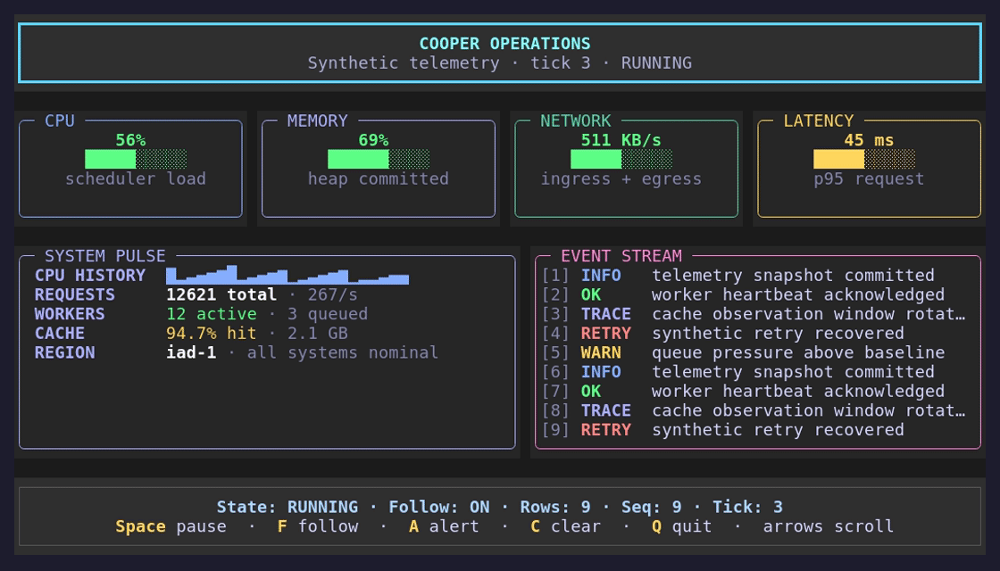
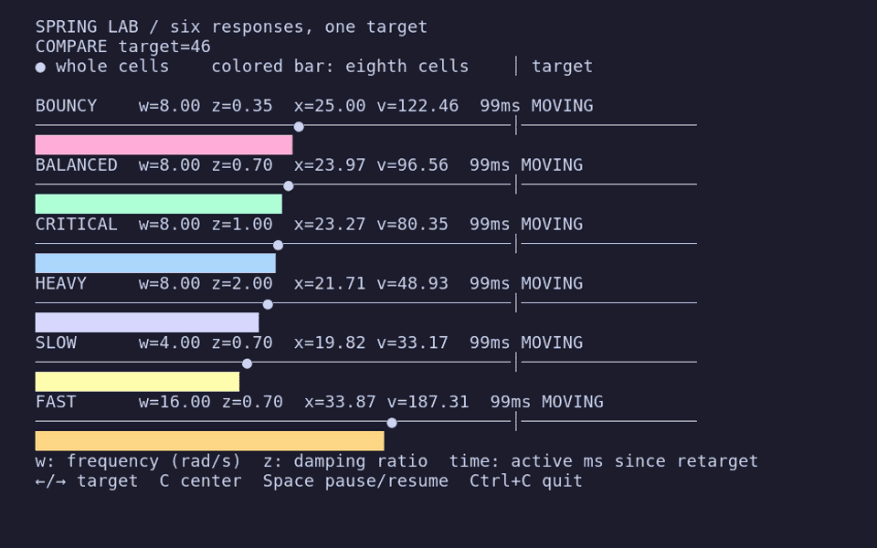

# Cooper

**An imperative retained-mode TUI framework** powered by
[Vaxis](https://github.com/rockorager/vaxis).

Cooper is heavily influenced by OpenTUI. A lot of TUI libraries are immediate mode or use heavy functional paradigms, and I wanted a retained mode library that provided
a similar imperative API to the DOM because that is intuitive to me, when building UIs.
Also, I just wanted to build TUIs with my programming language, Ard.





## Installation

```sh
ard add github.com/akonwi/cooper@latest
```

## Quickstart

```ard
use cooper
use cooper/ui

fn main() {
  let application = cooper::app().expect("could not create app")
  defer application.destroy()
  
  let field = ui::input(
    application.context,
    placeholder: "Type here, then press Ctrl+C to quit",
    styles: ui::style(
      width: ui::percent(100.0),
      height: ui::cells(1),
    ),
  )

  application.root.add(field)
  field.focus()
  application.run().expect("run Cooper")
}
```

`cooper` is the application namespace for App, Runtime, and events. `cooper/ui`
is the view-construction namespace for controls, layout, colors, geometry,
selection, and rich text.

## Features

- **Controls** — Box, Text, Image, Input, TextArea, ScrollBox, Scrollbar,
  Select, TabSelect. See the [controls list](docs/adrs/0002-define-application-api.md)
  and [examples](examples/README.md).
- **Animation** — Runtime-owned timelines and springs with easing, looping,
  and momentum-preserving retargeting. See [ADR 0014](docs/adrs/0014-define-animation-timelines.md),
  [ADR 0021](docs/adrs/0021-define-spring-animations.md), and the
  [spring lab example](examples/README.md#spring-comparisons).
- **Terminal screen modes** — Alternate screen, main buffer, inline, and
  split-footer configurations. See [ADR 0023](docs/adrs/0023-define-terminal-screen-modes.md)
  and the [screen modes example](examples/screen_modes.ard).
- **Declarative components** — Opt-in `cooper/cui` layer with persistent
  component structs, keyed reconciliation, and lifecycle hooks. (Feels like the good days of Backbone.js or React class components). See the
  [framework guide](docs/declarative.md).
- **Keymaps** — Typed commands, scoped bindings, control remapping, and
  discoverable shortcut labels. See the [keymap guide](docs/keymaps.md).
- **Clipboard, notifications, progress, title** — Runtime-exposed terminal
  services. See [ADR 0006](docs/adrs/0006-define-terminal-clipboard-access.md),
  [ADR 0009](docs/adrs/0009-define-terminal-mediated-notifications.md),
  [ADR 0010](docs/adrs/0010-define-terminal-progress-reporting.md),
  [ADR 0012](docs/adrs/0012-define-terminal-title-updates.md).

## Examples

The runnable examples exercise the public application and control APIs.
See [`examples/README.md`](./examples/README.md) for the full gallery,
behavior descriptions, and PTY smoke tests.

## Documentation

- **Design decisions** — Architecture Decision Records in [`docs/adrs/`](docs/adrs/);
  see [`docs/README.md`](docs/README.md) for the index
- **Declarative framework** — [`docs/declarative.md`](docs/declarative.md)
- **Keymaps and commands** — [`docs/keymaps.md`](docs/keymaps.md)
- **Examples and behavior** — [`examples/README.md`](examples/README.md)
- **Benchmarks and performance** — [`benchmarks/README.md`](benchmarks/README.md),
  [`docs/performance-optimization.md`](docs/performance-optimization.md)

## License

[BSD 3-Clause](./LICENSE).
