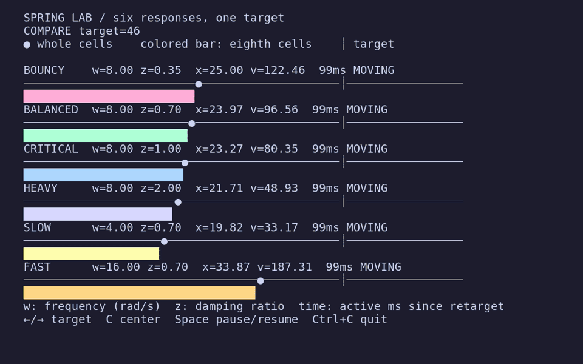

# Cooper examples

These applications exercise Cooper's accepted application API and require Ard
v0.39.0 or newer.

Every UI example imports the canonical `cooper` and `cooper/ui` entry points and
uses `App.context`, the permanent `App.root`, persistent public controls, and
explicit focus policy. Application-only fixtures import just `cooper`. Focused
imports are added only for specialized APIs such as animation and terminal
progress. Most examples use blocking `run()`; the lifecycle example demonstrates
nonblocking startup.

## Quickstart

`quickstart.ard` recreates OpenTUI's imperative quickstart with nested styled
Boxes, inherited colors, mutable Text, application key listeners, and the
two-import application and UI surface.

```sh
ard run quickstart.ard
```

Use Left and Right to change the counter, or press Q to quit.

## Declarative jobs

`declarative_jobs.ard` exercises the experimental `cooper/cui` framework
and requires Ard v0.42.0. Row factories receive ordinary typed props; persistent
components own editable notes and expandable details, while keyed reordering
preserves their component state, editor state, and focus.

```sh
ard run declarative_jobs.ard
python3 test_declarative_jobs.py
```

Type a note in Alpha, press F2 to expand details, F3 to reorder, and F4 to
remove/reinsert Beta. Press Ctrl+C to quit. See the
[framework guide](../docs/declarative.md) for identity and lifecycle contracts.

## CUI Tinear

`cui_tinear.ard` is a static-data adaptation of [tinear](https://github.com/akonwi/tinear).
It uses keyed issue cards, component-owned detail state, and declarative focus.
The Inbox uses a ScrollBoxRef for preview scrolling without changing focus.
Run `ard run cui_tinear.ard` or `python3 test_cui_tinear.py` here.

Use j/k or arrows for cards, h/l for columns, Enter to open/reuse an issue tab,
d/c for Description/Comments, and Escape to close the active issue tab.
Tab/Shift+Tab cycle through Inbox, My Issues, and open issue tabs; `1` opens Inbox
and `2` returns to My Issues.
Click tab labels to switch or their × to close. Closing an inactive tab leaves
the current page alone. Footer hints follow the active page.

`/` focuses the case-sensitive local
title/identifier filter; Enter accepts it, then Enter opens the selected result.
Escape clears the filter. Ctrl+C quits. A 126-column terminal shows all three
columns. Horizontal navigation preserves the row, clamps in shorter columns,
and skips empty columns. Selection scrolls fully into view on both axes; cards
can also be hovered and clicked to open. Column headings show result counts.
Open tabs retain their own section and loading/error state while hidden. Switching
does not cancel work; closing does. Reopening a closed tab starts fresh. The board
retains its filter and selection across tab switches.
This is not a full clone: document search, issue editing, drag/drop, and session
restoration across process restarts are not implemented.

`?` opens global issue search from any page. Type a case-sensitive title or ID,
use ↑/↓ to select, and Enter or a click to open/reuse its issue tab. Escape
closes the dialog and restores the previous page's focus. Search debounces for
300ms with simulated async work; changing the query clears old results, and
closing the dialog cancels pending work. The dialog blocks background clicks
and tab navigation. Global search is independent of the board's local filter.

Inbox has three static notifications in a 35% list / preview split. Use j/k or
arrows to select, Enter to open the selected issue, Backspace to archive locally,
and r to simulate refresh (archived notices stay archived). Click a row to select
it. h/l scroll the preview one row, Space/Shift+Space page by ten rows. Preview
loads are simulated, cached, and ignore stale responses. Selection resets preview
scrolling; switching tabs preserves the Inbox. Empty Inbox remains navigable.

Detail loading is simulated with a 650ms delay. Press r to reload/retry, f to
simulate a failed request, or Escape while loading to exercise automatic
component cancellation. On the board, r simulates a 700ms refresh while leaving
the static issue data unchanged. Repeated refreshes are single-flight; detail
reloads ignore superseded responses using a request counter. Components use
ordinary `async::start` workers, select on mount cancellation, and deliver state
changes through `ctx.dispatch`. No networking is involved.

## CUI Hacker News

`cui_hackernews.ard` is a read-only client for the official Hacker News Firebase
API, requiring Ard v0.42.0. It exercises real HTTP requests, component-owned
async scheduling, keyed lists, nested comments, focus reveal, and scrolling.

```sh
ard run cui_hackernews.ard
ard test hackernews
python3 test_cui_hackernews.py
HN_STRESS_COMMENTS=1000 python3 test_cui_hackernews.py
```

Use 1/2/3/4 for Top/New/Ask/Show, j/k or arrows to select, Enter or a click to
open a story or collapse/expand a comment, and Escape to return to the feed.
Space/PageDown and Shift+Space/PageUp scroll ten rows without moving selection,
including within comments taller than the viewport. Ctrl+C quits. Story URLs
are terminal hyperlinks; comment markup is rendered as plain text, preserving
paragraphs, Unicode, and link labels (not inline link destinations).

Each page processes batches of 30 items; m requests another batch and r retries
failures after current requests settle. Six workers per page and a shared
six-connection HTTP transport bound concurrency. Responses have a ten-second
timeout and a 2 MiB size cap. Successful items are cached for this process's
lifetime. Returning from a story retains the feed's selection and scroll;
switching feeds or closing a reader retires that component. The next read uses
the cache, but collapse state resets after closing a reader. Deleted/dead
comments retain their replies. Deep nesting caps visual indentation at 20 cells.

Ard 0.42 has no native HTTP/JSON modules, so those platform operations are
isolated in `hackernews/api.ard`. Workers use `ctx.dispatch`; unmount prevents
late UI updates and follow-on scheduling. **Already-running HTTP requests are
not actively aborted**: they finish or time out. This is not request cancellation.
The client is read-only: no authentication, voting, posting, or persistent cache.

The PTY test runs against a local HTTP fixture, not the public service. It checks
out-of-order completions, retries, cached expansion, deleted/dead comments,
nested replies, stale feed/reader completions, compact layout, and clean exit.
`HN_API_ROOT` overrides the API base URL for fixtures. `HN_CAPTURE_DIR` optionally
records ANSI snapshots. The larger stress run loads 1,034 items, including a
deep reply chain, and reports load time, process RSS on Linux, and paced key
latency. These timings include HTTP and rendering, not isolated render costs.
All loaded visible comments use ordinary retained nodes: no virtualization yet.
Large threads expose noticeable rendering latency; use this fixture to measure
future reconciliation/rendering improvements rather than treating it as a
performance target already met.

## Animation

`animation.ard` moves one retained Text control through a Runtime-owned typed
Timeline. It demonstrates easing, integer interpolation, a scheduled midpoint
callback, completion, and automatic return to demand-driven rendering.

```sh
ard run animation.ard
```

The animation starts automatically. Press Ctrl+C to quit after it completes.

## Spring comparisons



`spring_lab.ard` compares six presets on a shared horizontal scale in an
80×24 or larger terminal:

| Preset | Angular frequency (rad/s) | Damping ratio |
| --- | --- | --- |
| Bouncy | 8 | 0.35 |
| Balanced | 8 | 0.7 |
| Critical | 8 | 1 |
| Heavy | 8 | 2 |
| Slow | 4 | 0.7 |
| Fast | 16 | 0.7 |

Each lane shows a whole-cell marker, a colored fill bar with eighth-cell
resolution, a target guide, current position/velocity, and active elapsed time.
The first four lanes isolate damping; Slow and Fast vary the frequency of
Balanced. All use the same settling tolerances. `SETTLED` holds the final time
so the different settling times remain comparable. Bars clamp to their track
only for display; spring values retain their overshoot.

```sh
ard run spring_lab.ard
```

In the lab, Left/Right send every lane to the same left/right target, C chooses
the center, and Space freezes/resumes all lanes. Changing the target also
resumes playback and resets each lane's elapsed counter without resetting its
position or velocity. Press Ctrl+C to quit. Run `python3 test_animation.py` for
PTY checks of the spring lab and the timeline examples.

The GIF is recorded with [VHS v0.11.0](https://github.com/charmbracelet/vhs)
using [`screenshots/spring-lab.tape`](../screenshots/spring-lab.tape), then
optimized with gifsicle. With VHS, ttyd, ffmpeg, gifsicle, and DejaVu Sans Mono
installed, regenerate it from the repository root:

```sh
(cd examples && ard build --out ../ard-out/spring_lab spring_lab.ard)
vhs screenshots/spring-lab.tape
gifsicle -O3 --colors 64 --batch screenshots/spring-lab.gif
```

## Layout playground

`layout_playground.ard` keeps four colored cards mounted while seven keyboard-
selectable presets replace their complete Styles. It demonstrates horizontal and
vertical flow, wrapping, grow and shrink, alignment, space distribution,
row reversal, absolute positioning, clipping, z-index, and automatic reflow when
the terminal is resized.

```sh
ard run layout_playground.ard
```

Press 1–7 to choose a preset, Space to advance, or Q to quit.

## Text gallery

`text_gallery.ard` is a selectable specimen sheet for rich spans, terminal text
attributes, foreground and background colors, Unicode graphemes, links, wrapping,
and overflow. Three retained Text controls render the same replaceable sample
with word, character, and no wrapping.

```sh
ard run text_gallery.ard
```

Press 1–3 to choose text samples, Space to advance, E to toggle clipping and
ellipsis, C to clear the selection, or Q to quit. Drag or double-click text to
inspect the logical selection; link activation is intercepted by the gallery.

## Operations dashboard

`dashboard.ard` is a live synthetic operations console built entirely from
persistent Box, Text, and ScrollBox controls. A cancellation-aware background
fiber posts periodic metric, sparkline, status, and bounded event-stream updates
through `Runtime.dispatch`. The log follows new rows until the operator scrolls
or disables follow mode.

```sh
ard run dashboard.ard
```

Press Space to pause, F to toggle log following, A to insert a manual alert, C
to clear the event stream, or Q to quit. Arrow and paging keys scroll the focused
log; End restores follow mode.

## Stacking contexts

`stacking.ard` adapts OpenTUI's nested z-index and relative-positioning demos.
Three overlapping parent groups each own a shadow, panel, and `z=99` child badge;
the badge cannot escape its parent's sibling stacking order. Raising or moving a
parent updates the complete retained subtree, including paint and hit-test order.

```sh
ard run stacking.ard
```

Press 1–3 or Space to raise a layer, use arrows or H/J/K/L to move it, A to
toggle dispatched autoplay, R to reset the scene, or Q to quit. Exposed card
edges can also be clicked to raise their complete group.

## Input lab

`input_lab.ard` presents four retained single-line Inputs for minimum/maximum
lengths, app-owned email shape validation, Unicode grapheme limits, custom
selection styling, and editing with global selection disabled. Live diagnostics
separate input, change, submit, rejected submit, selection, and terminal paste
activity. The scrolling field panel reveals focused controls in compact windows.

```sh
ard run input_lab.ard
```

Press Tab or Shift+Tab to traverse, Return to submit, or Escape to clear the
selection. Mouse presses place the cursor and drags select text. Terminal paste
is normalized and still respects maximum length. Clipboard access remains a
separate App service rather than an Input command; multiline forms use the
separate retained TextArea control. Password Inputs remain unsupported. Press
Ctrl+C to quit.

## Mouse interaction demo

`event_inspector.ard` closely adapts OpenTUI's `mouse-interaction-demo.ts` with
Cooper's retained public controls. Four overlapping colored boxes can be raised,
dragged, scrolled, and dropped onto each other. Pointer movement leaves cyan
trail markers, captured drags leave orange markers, and empty-cell clicks toggle
a pink activation layer. The fourth box deliberately clips an oversized child.

```sh
ard run event_inspector.ard
```

Move and drag the pointer around the stage, click empty cells, or scroll over a
box. Press C to clear trail/activation markers, R to restore card positions, or
Ctrl+C to quit. Cooper uses opaque terminal colors and retained Text markers in
place of OpenTUI's alpha-blended framebuffer, fading trails, and timeline bounce,
but preserves the demo's primary interactive behaviors and visual organization.

## Interactive links

`links.ard` closely adapts OpenTUI's `link-demo.ts`: the same absolute header and
three colored project, documentation, and connection cards contain styled OSC 8
links. Cooper's destinations replace OpenTUI's, and opaque colors replace alpha
compositing. The header reports Cooper link activation directly.

```sh
ard run links.ard
```

With drag mode off, plain-click a link to open it with the host handler. Press D
to enable card dragging; cards preserve the pointer offset, clamp to terminal
bounds, and rise above siblings. Plain link activation is suppressed while drag
mode is on so grabbing linked text cannot launch a browser accidentally. Press D
again to restore link activation, or Ctrl+C to quit.

## Focus restore demo

`terminal_focus.ard` closely adapts OpenTUI's `focus-restore-demo.ts`. Its live
terminal-state panel tracks focus state, pointer coordinates, focus-in/out
counts, timestamps, and the first mouse event after each focus return. A bounded,
followed event log keeps the latest 20 focus and tracking-resume observations.

```sh
ard run terminal_focus.ard
```

Move the pointer, alt-tab away and back, then move it again. A `MOUSE RESUMED`
entry confirms the observable outcome without reaching through Cooper's public
API to count private backend mode-restoration calls. Terminals without DEC focus
reporting leave the state `UNKNOWN`. Press Ctrl+C to quit.

## Widget lab

`widgets.ard` combines Cooper's built-in Select and TabSelect controls with a
close app-local adaptation of OpenTUI's `slider-demo.ts`. F1 presents a
12-option horizontally scrolling TabSelect with separate highlight and
selection state. F2 presents a compact 20-option Select whose anchored menu has
descriptions, fast scrolling, wrapping, mouse activation, and an indicator. F3 presents three
horizontal and four vertical sliders with different ranges, dimensions, mouse
dragging, keyboard adjustment, reset, and two animated specimens.

```sh
ard run widgets.ard
```

Use F1–F3 or click the header controls to switch pages. Each page lists its own
keys; slider numbers 1–7 focus individual sliders. The choice-control pages
validate compact Select menu and TabSelect behavior.
Cooper uses Unicode block cells in place of OpenTUI's sub-cell slider renderer.
Press Ctrl+C to quit.

## Filesystem explorer

`explorer.ard` asynchronously reads the current working directory and creates
persistent public Box and Text controls through UI dispatch. Tab focuses the
first row, Enter and mouse presses activate rows, and the listing ScrollBox
handles wheel input.

```sh
ard run explorer.ard
```

## Test fixtures

Focused lifecycle and regression programs live in [`fixtures/`](./fixtures/)
rather than the public gallery. They preserve targeted ScrollBox, asynchronous
cancellation, application lifecycle, terminal focus, and end-to-end interaction
coverage without presenting overlapping showcase applications.

## PTY smoke tests

The harness builds generated executables in the repository-level `ard-out/`
directory.

```sh
python3 test_animation.py
python3 test_layout_playground.py
python3 test_text_gallery.py
python3 test_dashboard.py
python3 test_stacking.py
python3 test_input_lab.py
python3 test_text_area.py
python3 test_event_inspector.py
python3 test_links.py
python3 test_terminal_focus.py
python3 test_widgets.py
python3 test_clipboard.py
python3 test_notification.py
python3 test_scroll_form.py
python3 test_horizontal_scroll.py
python3 test_select.py
python3 test_async.py
python3 test_lifecycle.py
python3 test_explorer.py
python3 test_interaction.py
```

The tests cover terminal startup/restoration, demand-driven animation frames,
retained layout reconfiguration,
rich text, wrapping, overflow, links, selection, live dispatched metrics,
bounded follow-mode logs, nested stacking and hit order, Input validation and
commit callbacks, multiline TextArea editing and paste, draggable z-index objects, pointer trails,
activated cells, drag/drop routing, interactive links, link-safe drag mode,
terminal focus transitions, post-focus mouse resumption, built-in Select menu
and TabSelect behavior, app-local sliders, OSC 52 clipboard requests and responses,
terminal-mediated desktop notification output, Ghostty terminal progress states,
overflow clipping, editing,
explicit focus policy, mouse input, two-axis scrolling and
scrollbar dragging, resize, App
cancellation, asynchronous UI dispatch, nonblocking startup,
suspension/resume, filesystem rows, drag capture/drop ordering, hover
reconciliation, terminal focus, text and editable selection, and clean exit.
